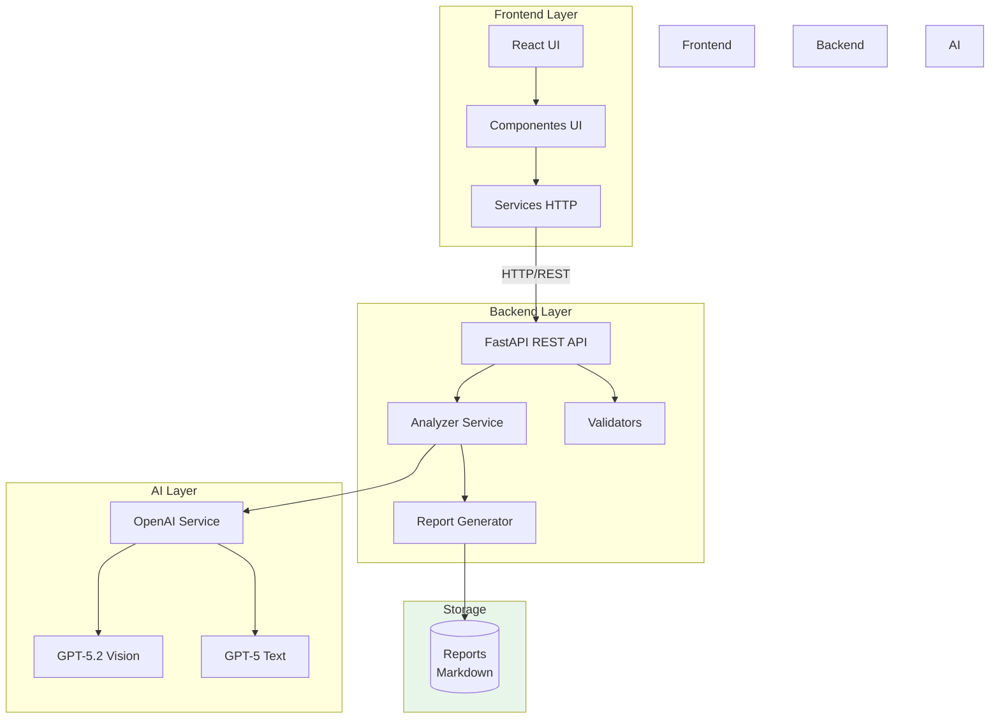
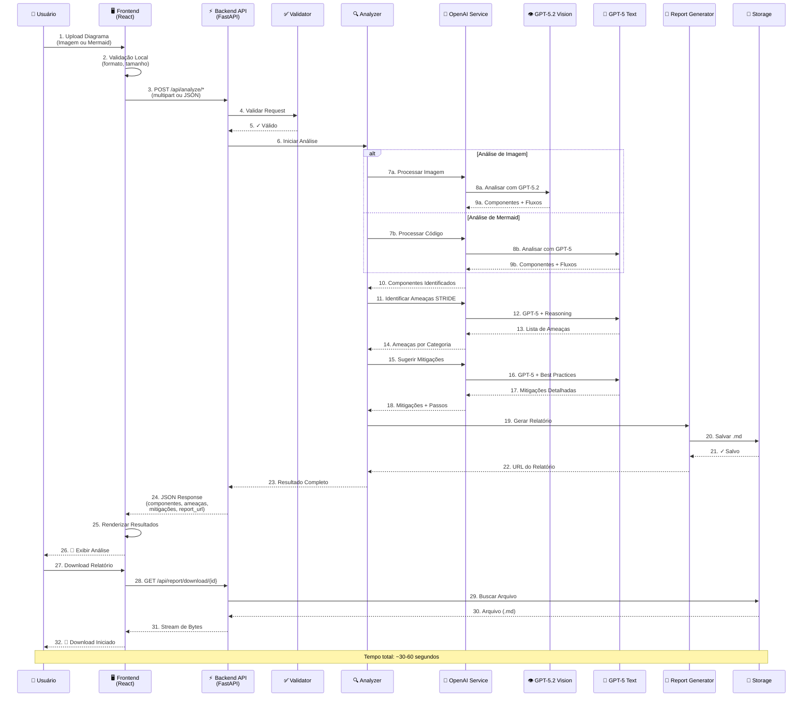
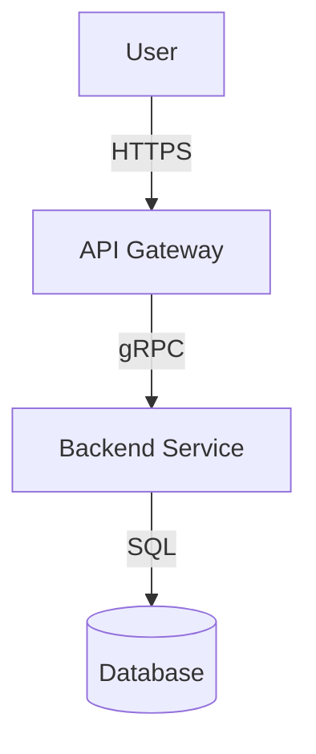

# 🔒 ThreatLens Analyzer

Sistema completo de análise automatizada de ameaças STRIDE para diagramas de arquitetura de software, utilizando IA (GPT-5.2 Vision e GPT-5 Reasoning) para identificar vulnerabilidades e sugerir mitigações.

## 📋 Visão Geral

**ThreatLens Analyzer** combina:
- 🎨 **Frontend**: Interface React moderna e responsiva
- ⚡ **Backend**: API REST FastAPI com integração OpenAI
- 🤖 **IA**: GPT-5.2 (Vision) e GPT-5 para análise de diagramas

## 🏛️ Arquitetura do Sistema

### Visão Geral da Arquitetura

O ThreatLens Analyzer segue uma arquitetura de três camadas, separando claramente a interface do usuário, a lógica de negócio e os serviços de IA:



### Fluxo de Análise Completo

Este diagrama mostra o fluxo completo desde o upload do diagrama até a geração do relatório final:



### Componentes Principais

#### 🎨 Frontend (React + TypeScript)
- **Responsabilidade**: Interface do usuário, validação de entrada, exibição de resultados
- **Tecnologias**: React 18, TypeScript, Vite, Tailwind CSS, Shadcn/ui
- **Comunicação**: HTTP REST com Backend

#### ⚡ Backend (FastAPI)
- **Responsabilidade**: Orquestração da análise, validação, geração de relatórios
- **Serviços**:
  - `analyzer.py`: Coordena o processo de análise STRIDE
  - `openai_service.py`: Integração com APIs da OpenAI
  - `report_generator.py`: Geração de relatórios em Markdown
  - `validators.py`: Validação de entrada e formato de dados

#### 🤖 Camada de IA (OpenAI)
- **GPT-5.2 Vision**: Análise de diagramas em imagens
- **GPT-5 Text**: Análise de código Mermaid, identificação de ameaças e sugestão de mitigações
- **Reasoning**: Raciocínio profundo para análise de segurança

### Tipos de Análise

#### 1️⃣ Análise de Imagem
```
Upload PNG/JPG → Base64 Encoding → GPT-5.2 Vision → Extração de Componentes → Análise STRIDE
```

#### 2️⃣ Análise de Mermaid
```
Código Mermaid → Validação de Sintaxe → GPT-5 Text → Interpretação → Análise STRIDE
```

### Metodologia STRIDE

O sistema identifica ameaças nas 6 categorias:

| Categoria | Foco | Exemplo |
|-----------|------|---------|
| **S**poofing | Autenticação | Falta de MFA, tokens fracos |
| **T**ampering | Integridade | Comunicação não criptografada |
| **R**epudiation | Auditoria | Falta de logs de ações |
| **I**nformation Disclosure | Confidencialidade | Dados sensíveis expostos |
| **D**enial of Service | Disponibilidade | Falta de rate limiting |
| **E**levation of Privilege | Autorização | Controle de acesso inadequado |

## 🚀 Como Executar

### Pré-requisitos

- **Python 3.8+** (backend)
- **Node.js 18+** ou **Bun** (frontend)
- **Chave API OpenAI** com acesso ao GPT-5.2 e GPT-5

### 1️⃣ Backend (API)

```bash
# Navegar para o diretório backend
cd backend

# Criar ambiente virtual
python -m venv venv

# Ativar ambiente virtual
# Windows:
venv\Scripts\activate
# Linux/Mac:
source venv/bin/activate

# Instalar dependências
pip install -r requirements.txt

# Configurar variáveis de ambiente
# Copie o arquivo .env.example para .env e adicione sua chave OpenAI
cp .env.example .env
# Edite o .env e adicione: OPENAI_API_KEY=sk-...

# Executar servidor
python main.py
# ou
uvicorn main:app --reload --port 5000
```

O backend estará disponível em: **http://localhost:5000**

Documentação Swagger: **http://localhost:5000/docs**

### 2️⃣ Frontend (Interface Web)

```bash
# Navegar para o diretório frontend
cd front

# Instalar dependências
npm install
# ou com Bun:
bun install

# Executar servidor de desenvolvimento
npm run dev
# ou com Bun:
bun dev
```

O frontend estará disponível em: **http://localhost:5173**

### 3️⃣ Configuração

#### Backend (.env)

Crie um arquivo `.env` na pasta `backend/` com:

```env
OPENAI_API_KEY=sk-proj-your-key-here
OPENAI_VISION_MODEL=gpt-5.2
OPENAI_TEXT_MODEL=gpt-5
OPENAI_MAX_TOKENS=16000
API_HOST=0.0.0.0
API_PORT=5000
DEBUG=True
CORS_ORIGINS=["http://localhost:5173"]
```

#### Frontend (api.config.ts)

O arquivo `front/src/config/api.config.ts` já está configurado para o backend local:

```typescript
export const API_CONFIG = {
  BASE_URL: "http://localhost:5000",
  ENDPOINTS: {
    ANALYZE_IMAGE: "/api/analyze/image",
    ANALYZE_MERMAID: "/api/analyze/mermaid",
    DOWNLOAD_REPORT: "/api/report/download",
  },
  TIMEOUT: 600000, // 10 minutos
};
```

## 📖 Funcionalidades

### 1. Análise de Imagens

Upload de diagramas de arquitetura (PNG, JPG, JPEG) para análise automática de ameaças STRIDE.

### 2. Análise de Código Mermaid

Análise de diagramas definidos em código Mermaid.

Exemplo:


### 3. Categorias STRIDE

- **S** - Spoofing (Falsificação de identidade)
- **T** - Tampering (Adulteração de dados)
- **R** - Repudiation (Repúdio de ações)
- **I** - Information Disclosure (Vazamento de informações)
- **D** - Denial of Service (Negação de serviço)
- **E** - Elevation of Privilege (Escalação de privilégios)

### 4. Relatórios

Geração automática de relatórios em **Markdown** com:
- Componentes identificados
- Fluxos de dados
- Ameaças encontradas (com severidade)
- Mitigações sugeridas (com passos detalhados)
- Suposições e incertezas

## 🏗️ Estrutura do Projeto

```
threatlens-analyzer/
├── backend/              # API FastAPI
│   ├── config/          # Configurações
│   ├── models/          # Modelos Pydantic
│   ├── services/        # Lógica de negócio
│   ├── utils/           # Utilitários
│   ├── reports/         # Relatórios gerados
│   └── main.py          # App principal
│
├── front/               # Frontend React
│   ├── src/
│   │   ├── components/  # Componentes UI
│   │   ├── services/    # Serviços HTTP
│   │   ├── config/      # Configurações
│   │   └── pages/       # Páginas
│   └── public/          # Arquivos estáticos
│
└── docs/                # Documentação
    └── ARCHITECTURE.md  # Arquitetura detalhada
```

## 📚 Documentação

- **[ARCHITECTURE.md](docs/ARCHITECTURE.md)** - Arquitetura completa do sistema
- **[Backend README](backend/README.md)** - Documentação específica do backend
- **[Frontend README](front/README.md)** - Documentação específica do frontend
- **[Swagger UI](http://localhost:5000/docs)** - Documentação interativa da API

## 🔌 Endpoints da API

### POST /api/analyze/image
Upload de imagem (multipart/form-data) para análise.

### POST /api/analyze/mermaid
Análise de código Mermaid (JSON).

### GET /api/report/download/{filename}
Download de relatório gerado (.md).

## 🛠️ Tecnologias

### Backend
- **FastAPI** - Framework web moderno
- **OpenAI GPT-5.2** - Análise avançada de imagens com visão
- **OpenAI GPT-5** - Raciocínio inteligente para texto e código
- **Pydantic** - Validação de dados
- **Uvicorn** - Servidor ASGI

### Frontend
- **React 18** - Biblioteca UI
- **TypeScript** - Tipagem estática
- **Vite** - Build tool
- **Tailwind CSS** - Framework CSS
- **Shadcn/ui** - Componentes UI
- **Mermaid** - Renderização de diagramas

## 🧪 Testes

### Backend
```bash
cd backend
pytest
```

### Frontend
```bash
cd front
npm run test
# ou
bun test
```

## 🐛 Troubleshooting

### Backend não conecta ao OpenAI
- Verifique se a chave `OPENAI_API_KEY` está correta no `.env`
- Verifique se tem créditos disponíveis na conta OpenAI
- Teste a chave: `curl https://api.openai.com/v1/models -H "Authorization: Bearer $OPENAI_API_KEY"`

### Frontend não conecta ao Backend
- Verifique se o backend está rodando em `http://localhost:5000`
- Verifique o console do navegador para erros de CORS
- Confirme que o `CORS_ORIGINS` no backend inclui `http://localhost:5173`

### Relatórios não são gerados
- Verifique se a pasta `backend/reports/` existe e tem permissões de escrita
- Consulte os logs do backend para mensagens de erro

## 📝 Licença

MIT License - veja [LICENSE](backend/LICENSE) para detalhes.
