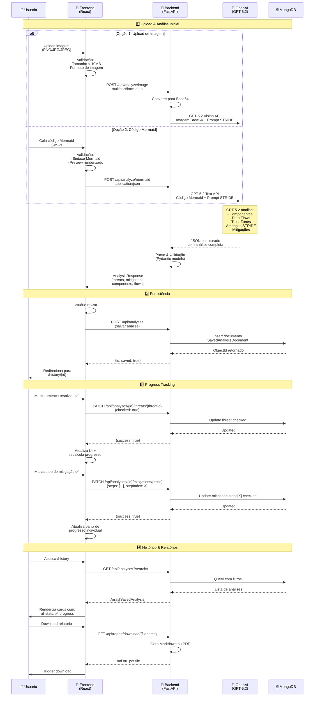

# 🔒 ThreatLens Analyzer

<div align="center">


[](https://fastapi.tiangolo.com)
[](https://reactjs.org)
[](https://www.mongodb.com)
[](https://openai.com)
[](https://www.docker.com)

**Análise automatizada de ameaças STRIDE em diagramas de arquitetura usando IA**

[🚀 Quick Start](#-quick-start-com-docker) • [📖 Documentação](#-documentação-da-api) • [🎯 Features](#-features) • [🏗️ Arquitetura](#️-arquitetura)

</div>

---

## 🎯 Sobre o Projeto

**ThreatLens Analyzer** é uma ferramenta completa de análise de segurança que utiliza IA (OpenAI GPT) para identificar automaticamente ameaças STRIDE em diagramas de arquitetura de software.

### Por que usar?

- ✅ **Economize Tempo**: Análise automática em minutos vs horas manual
- ✅ **Cobertura Completa**: Todas as 6 categorias STRIDE analisadas
- ✅ **Mitigações Práticas**: Sugestões detalhadas com passos de implementação
- ✅ **Histórico Persistente**: MongoDB com todas as análises salvas
- ✅ **Progress Tracking**: Acompanhe resolução de ameaças e implementação de mitigações
- ✅ **Deploy Fácil**: Um comando Docker Compose sobe tudo

---

## 🎯 Features

### 🔍 Análise Inteligente com IA
- **Processamento de Imagens**: Upload de diagramas PNG, JPG, JPEG
- **Suporte Mermaid**: Cole código Mermaid direto
- **Identificação Automática**: Componentes, fluxos de dados, trust zones
- **Classificação STRIDE**: 6 categorias de ameaças
- **Severidade**: Low, Medium, High, Critical

### 📊 Gestão Completa de Ameaças
- **Dashboard de Estatísticas**: Métricas em tempo real
- **Histórico Completo**: Todas as análises no MongoDB
- **Checkboxes de Progresso**: Marque ameaças resolvidas
- **Tracking por Step**: Acompanhe cada etapa de mitigação individualmente
- **Busca e Filtros**: Por nome, descrição ou tags
- **Exportação**: Relatórios em Markdown e PDF

### 🎨 Interface Moderna
- **Design Responsivo**: Funciona em mobile, tablet e desktop
- **Dark Mode**: Nativo e elegante
- **Componentes Shadcn/ui**: Interface profissional
- **Loading States**: Feedback visual em todas as operações
- **Navegação Intuitiva**: React Router com rotas claras

---

## 🏗️ Arquitetura

### Stack Completa em Docker

```
┌──────────────────────────────────────────────────────────────┐
│                    Docker Compose Network                     │
│                  (threatlens-network - bridge)                │
│                                                               │
│  ┌────────────────────┐    ┌──────────────────────┐         │
│  │   Frontend (React) │    │   Backend (FastAPI)  │         │
│  │   Port: 8081       │◄───┤   Port: 5000         │         │
│  │                    │    │                      │         │
│  │  - React 18        │    │  - Python 3.13-slim  │         │
│  │  - TypeScript      │    │  - Motor + Beanie    │         │
│  │  - Vite + Tailwind │    │  - OpenAI GPT-5.2    │         │
│  │  - Shadcn/ui       │    │  - FastAPI + Uvicorn │         │
│  │  - React Router    │    │  - Pydantic          │         │
│  │                    │    │                      │         │
│  │  Health: wget      │    │  Health: HTTP check  │         │
│  └────────────────────┘    └──────────┬───────────┘         │
│                                       │                      │
│                                       ▼                      │
│                          ┌──────────────────────┐           │
│                          │   MongoDB 7.0        │           │
│                          │   Port: 27017        │           │
│                          │                      │           │
│                          │  - NoSQL Database    │           │
│                          │  - Beanie ODM        │           │
│                          │  - Volume Persist    │           │
│                          │                      │           │
│                          │  Health: mongosh     │           │
│                          └──────────────────────┘           │
│                                                               │
└──────────────────────────────────────────────────────────────┘
```

### Fluxo Completo de Análise



### Arquitetura de Componentes Backend

```
backend/
│
├── main.py ────────────────► FastAPI app + CORS + routers
│
├── config/
│   └── settings.py ────────► Environment vars (OpenAI, MongoDB)
│
├── models/
│   ├── request_models.py ──► Pydantic (entrada da API)
│   ├── response_models.py ─► Pydantic (saída da API)
│   └── db_models.py ───────► Beanie (MongoDB ODM)
│
├── services/
│   ├── openai_service.py ──► 🤖 Comunicação com GPT-5.2
│   │                          └─ encode_image_base64()
│   │                          └─ analyze_diagram_with_vision()
│   │                          └─ parse_analysis_response()
│   │
│   ├── analyzer.py ────────► 📊 Lógica STRIDE
│   │                          └─ analyze_architecture()
│   │                          └─ generate_threats()
│   │                          └─ generate_mitigations()
│   │
│   ├── report_generator.py ► 📄 Geração de relatórios
│   │                          └─ generate_report() [MD/PDF]
│   │
│   └── analysis_routes.py ─► 🔌 CRUD Endpoints
│                               └─ GET /api/analyses
│                               └─ POST /api/analyses
│                               └─ PATCH /api/analyses/{id}/threats/{tid}
│                               └─ PATCH /api/analyses/{id}/mitigations/{mid}
│                               └─ DELETE /api/analyses/{id}
│
└── utils/
    └── validators.py ──────► ✓ Validações customizadas
```

### Arquitetura de Componentes Frontend

```
front/src/
│
├── App.tsx ────────────────► Router + Theme Provider
│
├── pages/
│   ├── Index.tsx ──────────► 🏠 Landing + New Analysis Form
│   ├── History.tsx ────────► 📚 Lista de análises salvas
│   └── AnalysisDetails.tsx ► 📋 Detalhes + Progress Tracking
│
├── components/
│   ├── DiagramInput.tsx ───► 📸 Upload imagem / Mermaid input
│   ├── SettingsPanel.tsx ──► ⚙️ Opções de análise
│   ├── MermaidPreview.tsx ─► 👁️ Preview de Mermaid
│   │
│   └── results/
│       ├── SummaryPanel.tsx ─────► 📊 Estatísticas gerais
│       ├── ThreatsCard.tsx ──────► ⚠️ Lista de ameaças + ✅
│       ├── MitigationsCard.tsx ──► 🛡️ Lista de mitigações + ✅ steps
│       ├── ComponentsCard.tsx ───► 🧩 Componentes identificados
│       ├── DataFlowsCard.tsx ────► 🔄 Fluxos de dados
│       └── ResultsActionBar.tsx ─► 💾 Salvar, 📥 Download MD/PDF
│
├── services/
│   ├── api.service.ts ─────► 🌐 Axios client
│   │                          └─ analyzeImage()
│   │                          └─ analyzeMermaid()
│   │                          └─ getAllAnalyses()
│   │                          └─ updateThreatStatus()
│   │                          └─ updateMitigationStep()
│   │
│   └── mock-api.service.ts ► 🧪 Mock data (desenvolvimento)
│
├── lib/
│   ├── types.ts ───────────► 📘 TypeScript interfaces
│   └── utils.ts ───────────► 🛠️ Helpers (formatação, etc)
│
└── hooks/
    ├── useTheme.tsx ───────► 🌙 Dark/Light mode
    └── use-toast.ts ───────► 🍞 Toast notifications
```

### Modelo de Dados MongoDB

```javascript
// Collection: analyses
{
  _id: ObjectId("..."),
  name: "E-commerce Platform Analysis",
  description: "Security analysis for e-commerce...",
  diagram_type: "image",
  created_at: ISODate("2026-01-27T18:30:00Z"),
  updated_at: ISODate("2026-01-27T18:30:00Z"),
  tags: ["production", "ecommerce", "critical"],
  
  // Componentes identificados
  components: [
    {
      id: "comp_1",
      name: "API Gateway",
      type: "api",
      description: "Entry point...",
      trust_zone: "DMZ"
    }
  ],
  
  // Fluxos de dados
  data_flows: [
    {
      id: "flow_1",
      source: "Frontend",
      destination: "API Gateway",
      data_type: "User credentials",
      protocol: "HTTPS"
    }
  ],
  
  // Ameaças STRIDE
  threats: [
    {
      id: "threat_1",
      stride_category: "Spoofing",
      title: "Token Forgery",
      description: "JWT tokens could be forged...",
      severity: "High",
      affected_components: ["comp_1"],
      checked: false  // ✅ Progress tracking
    }
  ],
  
  // Mitigações
  mitigations: [
    {
      id: "mitigation_1",
      title: "Implement JWT Signature Verification",
      description: "Use RS256 algorithm...",
      related_threats: ["threat_1"],
      priority: "High",
      
      // Steps individuais com tracking
      steps: [
        {
          description: "Install jsonwebtoken library",
          checked: false
        },
        {
          description: "Configure RS256 keys",
          checked: true  // ✅ Step completo
        }
      ]
    }
  ],
  
  // Metadata da análise
  analysis_metadata: {
    total_components: 8,
    total_threats: 12,
    total_mitigations: 15,
    severity_distribution: {
      critical: 2,
      high: 5,
      medium: 4,
      low: 1
    }
  }
}
```

---

## 🚀 Quick Start com Docker

### Pré-requisitos

- [Docker](https://www.docker.com/get-started) instalado
- [Docker Compose](https://docs.docker.com/compose/install/) instalado  
- Chave API da OpenAI ([obtenha aqui](https://platform.openai.com/api-keys))

### Passos Rápidos

**1. Clone o repositório**

```bash
git clone https://github.com/seu-usuario/threatlens-analyzer.git
cd threatlens-analyzer
```

**2. Configure a chave OpenAI**

```bash
cp .env.example .env
```

Edite `.env` e adicione sua chave:

```env
OPENAI_API_KEY=sk-your-actual-openai-key-here
```

**3. Suba todos os serviços**

```bash
docker-compose up -d
```

Isso vai subir:
- 🗄️ MongoDB (porta 27017)
- 🚀 Backend API (porta 5000)
- 🎨 Frontend (porta 8081)

**4. Acesse a aplicação**

Abra: **http://localhost:8081**

Pronto! 🎉

---

## 🛠️ Instalação Manual (sem Docker)

### 1. MongoDB

```bash
# Apenas MongoDB com Docker
docker run -d -p 27017:27017 --name threatlens-mongodb mongo:7.0
```

### 2. Backend

```bash
cd backend

# Criar ambiente virtual
python -m venv venv
source venv/bin/activate  # Linux/Mac
# OU
.\venv\Scripts\activate   # Windows

# Instalar dependências
pip install -r requirements.txt

# Configurar .env
cp .env.example .env
# Edite .env com sua chave OpenAI

# Iniciar servidor
python main.py
```

Backend em: http://localhost:5000

### 3. Frontend

```bash
cd front

# Instalar dependências
npm install

# Iniciar dev server
npm run dev
```

Frontend em: http://localhost:8081

---

## 💡 Como Usar

### Criar Nova Análise

1. Acesse http://localhost:8081
2. Clique em **"Começar Análise"**
3. Digite um **nome para a análise**
4. Escolha o tipo de entrada:
   - **📷 Imagem**: Upload de diagrama (PNG/JPG)
   - **📝 Mermaid**: Cole código Mermaid

5. Configure opções (opcional):
   - Profundidade da análise
   - Formato do relatório (Markdown ou PDF)
   - Incluir severidade
   - Incluir assumptions

6. Clique em **"Analisar"**

### Visualizar Histórico

1. Clique em **"Histórico"** no menu
2. Veja todas as análises com:
   - 📊 Estatísticas de ameaças
   - ✅ Progresso de mitigações
   - 🏷️ Tags e datas
3. Use a **busca** para filtrar

### Acompanhar Progresso

1. Clique em uma análise
2. ✅ Marque checkboxes de ameaças resolvidas
3. ✅ Clique em steps de mitigações implementadas
4. 📈 Veja o progresso atualizar em tempo real
5. 📥 Baixe o relatório completo (Markdown ou PDF)

---

## 📖 Documentação da API

### Swagger UI

Acesse: **http://localhost:5000/docs**

### Endpoints Principais

#### Análise de Diagramas

```http
# Analisar código Mermaid
POST /api/analyze/mermaid
Content-Type: application/json

{
  "mermaidText": "graph TD\n  A[User] --> B[API]",
  "analysisDepth": "full"
}

# Analisar imagem
POST /api/analyze/image
Content-Type: multipart/form-data

imageFile: <binary>
```

#### Gestão de Análises

```http
# Listar todas
GET /api/analyses?search=ecommerce&tags=production

# Buscar por ID  
GET /api/analyses/{id}

# Criar nova
POST /api/analyses

# Deletar
DELETE /api/analyses/{id}
```

#### Progress Tracking

```http
# Marcar ameaça como resolvida
PATCH /api/analyses/{id}/threats/{threatId}

# Marcar step de mitigação como completo
PATCH /api/analyses/{id}/mitigations/{mitigationId}
```

---

## 🔌 Tecnologias

### Frontend
- **React 18** - UI Library
- **TypeScript** - Type Safety
- **Vite** - Build Tool
- **Tailwind CSS** - Styling
- **Shadcn/ui** - Components
- **React Router** - Navigation
- **date-fns** - Formatting

### Backend
- **FastAPI** - Framework
- **Python 3.13** - Language
- **Pydantic** - Validation
- **Motor** - Async MongoDB
- **Beanie** - ODM
- **OpenAI** - AI Integration

### Database
- **MongoDB 7.0** - NoSQL
- **Docker** - Container

---

## 📁 Estrutura do Projeto

```
threatlens-analyzer/
├── backend/                    # Backend FastAPI
│   ├── config/                 # Settings & Database
│   ├── models/                 # Pydantic Models
│   ├── services/               # Business Logic
│   │   ├── analyzer.py         # STRIDE Analysis
│   │   ├── openai_service.py   # OpenAI Integration
│   │   ├── report_generator.py # Reports
│   │   └── analysis_routes.py  # CRUD Endpoints
│   ├── utils/                  # Utilities
│   ├── main.py                 # Entry Point
│   ├── Dockerfile              # Docker Build
│   └── requirements.txt
│
├── front/                      # Frontend React
│   ├── src/
│   │   ├── components/         # UI Components
│   │   ├── pages/              # Pages
│   │   │   ├── Index.tsx       # Home
│   │   │   ├── History.tsx     # History List
│   │   │   └── AnalysisDetails.tsx # Detail View
│   │   ├── services/           # API Services
│   │   └── lib/                # Types & Utils
│   ├── Dockerfile
│   └── package.json
│
├── docker-compose.yml          # Full Stack Orchestration
├── .env.example                # Environment Template
└── README.md                   # You are here
```

---

## 🐳 Comandos Docker Úteis

```bash
# Iniciar todos os serviços
docker-compose up -d

# Ver logs
docker-compose logs -f

# Ver logs de um serviço específico
docker-compose logs -f backend

# Parar serviços
docker-compose down

# Parar e limpar dados (cuidado!)
docker-compose down -v

# Rebuild após mudanças
docker-compose up -d --build

# Ver status
docker-compose ps
```

---

## 📊 Categorias STRIDE

| Categoria | Sigla | Descrição | Exemplo |
|-----------|-------|-----------|---------|
| **Spoofing** | S | Falsificação de identidade | Tokens falsificados |
| **Tampering** | T | Adulteração de dados | Modificação em trânsito |
| **Repudiation** | R | Negação de ações | Falta de logs |
| **Information Disclosure** | I | Vazamento de dados | Dados expostos |
| **Denial of Service** | D | Negação de serviço | Sobrecarga |
| **Elevation of Privilege** | E | Escalação de privilégios | Acesso não autorizado |

---

## 🔒 Segurança

### Boas Práticas Implementadas

- ✅ Validação de entrada (Pydantic)
- ✅ Limite de upload (10MB)
- ✅ Timeout de requisições
- ✅ CORS configurável
- ✅ Logs sanitizados
- ✅ Environment variables

### ⚠️ Importante

- **Nunca** commite `.env` com chaves reais
- Use **HTTPS** em produção
- Configure **CORS** apropriadamente
- Implemente **autenticação** para produção

---

## 🧪 Testes

### Testar API

Acesse: http://localhost:5000/docs

Use o Swagger UI interativo para testar todos os endpoints.

### Verificar Serviços

```bash
# MongoDB
docker exec -it threatlens-mongodb mongosh

# Backend
curl http://localhost:5000/docs

# Frontend
curl http://localhost:8081
```

---

## 📦 Deploy em Produção

### Checklist

- [ ] Configure variáveis de ambiente
- [ ] Use HTTPS (nginx/traefik)
- [ ] Configure autenticação
- [ ] Habilite logs estruturados
- [ ] Configure backup do MongoDB
- [ ] Use health checks
- [ ] Configure limite de rate
- [ ] Monitore com Prometheus/Grafana

---

## 🤝 Contribuindo

1. Fork o projeto
2. Crie uma branch (`git checkout -b feature/AmazingFeature`)
3. Commit (`git commit -m 'Add AmazingFeature'`)
4. Push (`git push origin feature/AmazingFeature`)
5. Abra um Pull Request

---

## 📝 Licença

MIT License - veja [LICENSE](LICENSE) para detalhes.

---

## 🙏 Agradecimentos

- **OpenAI** pela API GPT
- **FastAPI** pela framework incrível
- **Shadcn/ui** pelos componentes lindos
- **Comunidade open source**

---

## 📞 Suporte

- 🐛 Issues: [GitHub Issues](https://github.com/seu-usuario/threatlens-analyzer/issues)
- 📖 Docs: http://localhost:5000/docs
- 💬 Discussões: [GitHub Discussions](https://github.com/seu-usuario/threatlens-analyzer/discussions)

---

<div align="center">

**[⬆ Voltar ao topo](#-threatlens-analyzer)**

Desenvolvido com ❤️ para tornar a análise de segurança mais acessível

</div>
